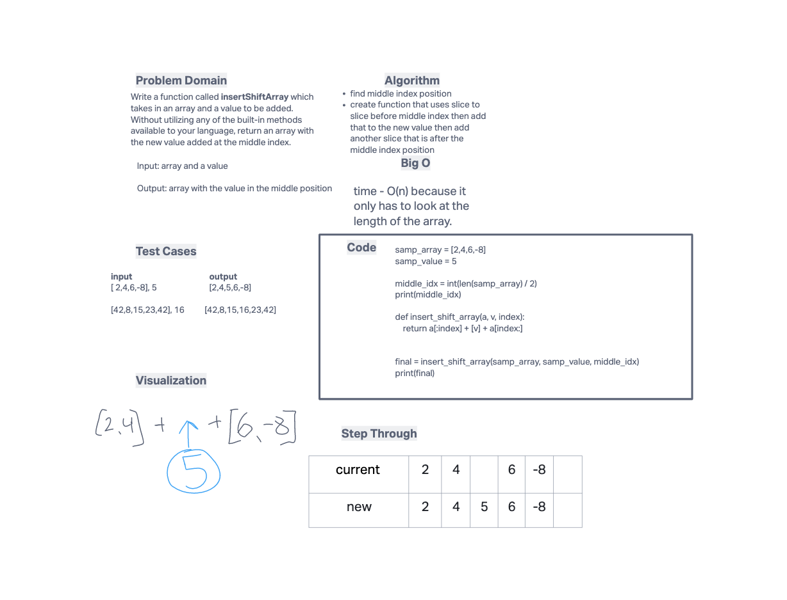

# Insert to Middle of an Array
Write a function called insertShiftArray which takes in an array and a value to be added. Without utilizing any of the built-in methods available to your language, return an array with the new value added at the middle index.

## Whiteboard Process

## Approach & Efficiency
- first I figured out how to find the middle index for a given llist by taking the length of the list and dividing by 2 and then converting to an integer in the case of even numbers
- for my array_insert_shift function I used the slice function to slice off the indices before the middle index, add the new value to add, and then add a slice of the indices after the middle index.
- I did my testing in main.py and then copied the code to the whiteboard in Invision.
- I'm still a bit unclear on how to determine the efficiency but I believe it will be O(n) because it is linear and only increases with the length of the list.
