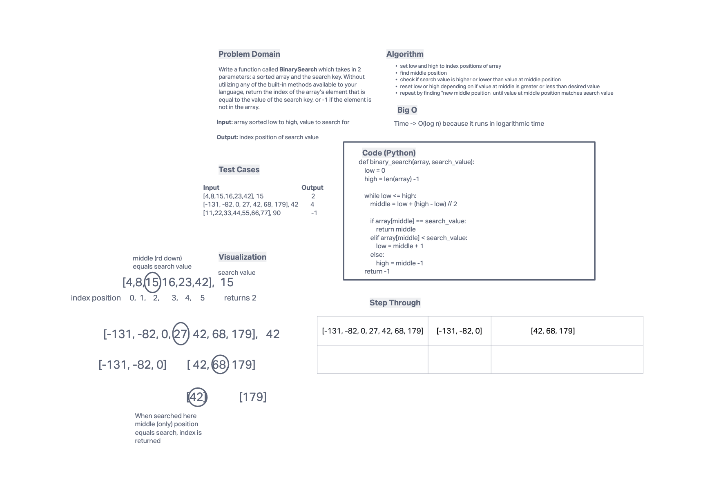

# Binary Search of Sorted Array
Write a function called `BinarySearch` which takes in 2 parameters: a sorted array and the search key. Without utilizing any of the built-in methods available to your language, return the index of the array’s element that is equal to the value of the search key, or -1 if the element is not in the array.

## Whiteboard Process

## Approach & Efficiency
- I started by defining the initial low and high values for the index positions
- then determined middle position
- then a loop that checks if the middle is the search value and returns that index position
- if not check if the value is greater or less than the search value and redefines the low or high position to be in the old middle position
- repeats until the search value is the value in the middle position
- Efficiency is logarithmic
