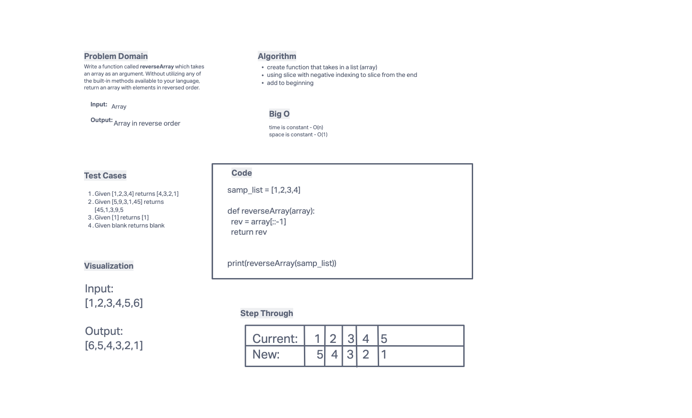

# Reverse an Array
Challenge Write a function called reverseArray which takes an array as an argument. Without utilizing any of the built-in methods available to your language, return an array with elements in reversed order.
## Whiteboard Process

## Approach & Efficiency
This would have been piece of cake with .reverse method but we couldn't use it. I used the slice method with a negative index to slice off from the end of the array (list) and add it to the front position.

