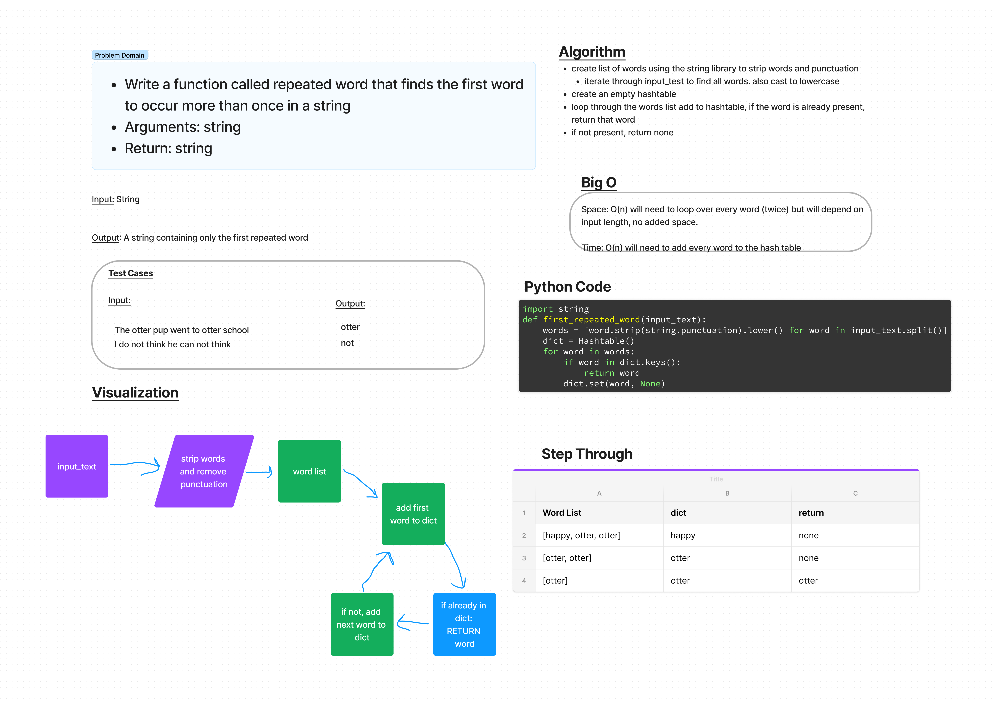

# Challenge Summary
## Challenge Type: Code Challenge / Algorithm
-Write a function called repeated word that finds the first word to occur more than once in a string
Arguments: string
Return: string

## Whiteboard Process

## Approach & Efficiency
- create word list by stripping and cast to lowercase
- add words to dict and if already present in dict, return that word

### Big O
- O(n) for space and time because it will depend on the length of the input

## Solution
code is found at code_challenges/hashtable_repeated_word.py

all tests passing from /tests/code_challenges/test_hashtable_repeated_word.py
