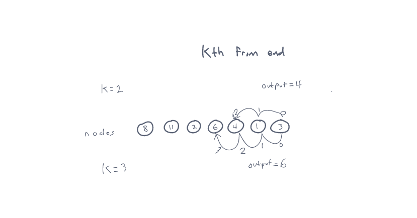

# Challenge 07
Extending an implementation of a Singly Linked List
file located at ./data_structures/linked_list.py
## Challenge
- Extending an implementation
### Feature Tasks
Add these methods to the LinkedList class:
- kth from end
    - argument: a number, `k`, as a parameter.
    - Return the node’s value that is `k` places from the tail of the linked list.
    - You have access to the Node class and all the properties on the Linked List class as well as the methods created in previous challenges.
### Whiteboard

new methods to add to Linked List class

## Approach & Efficiency
- Made a Linked List Class to instantiate a new linked list
- added methods for `insert`, `includes`, `"to string"`, `append`, `insert before`, `insert after`, and `kth from end`
- made a Node class to create new nodes

## API
LinkedList class now has the following Methods available
- insert `insert(self, value)` will insert a new node to the head of the linked list with the supplied value
- includes `includes(self, value)` will return True if the value provided is included in the linked list
- to string `__str__(self)` returns a string containing the contents of the full linked list.
- append `append(new value` adds a new node with the given `new value` to the end of the list.
- insert before `insert_before(value, new value)`adds a new node with the given new value immediately before the first node that has the value specified
- insert after `insert_after(value, new value)`adds a new node with the given new value immediately after the first node that has the value specified
- kth from end `kth_from_end(k)` returns the nodes value that is k places from the tail of the linked list.

## Testing
- test to prove the following functionality:
  - Can successfully add a node to the end of the linked list
  - Can successfully add multiple nodes to the end of a linked list
  - Can successfully insert a node before a node located in the middle of a linked list
  - Can successfully insert a node before the first node of a linked list
  - Can successfully insert after a node in the middle of the linked list
  - Can successfully insert a node after the last node of the linked list

all tests are passing

- Tests are accessed in ./tests/data_structures/test_linked_list_insertions.py
