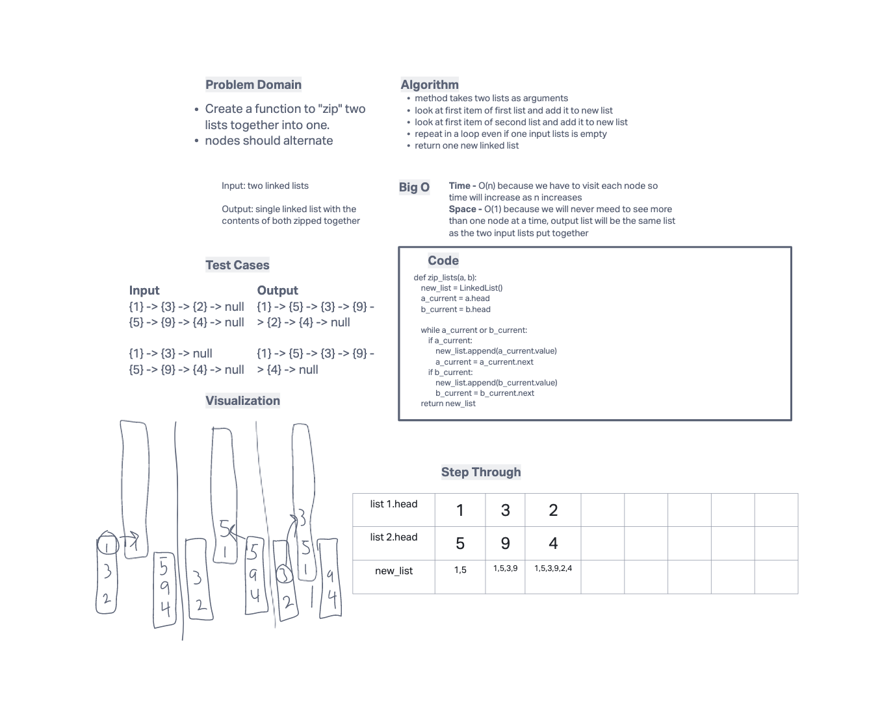

# Challenge 08
Extending an implementation of a Singly Linked List

## Challenge
- Code Challenge / Algorithm
### Feature Tasks
Add these methods to the LinkedList class:
- Write a function called zip lists
- Arguments: 2 linked lists
- Return: New Linked List, zipped as noted below
- Zip the two linked lists together into one so that the nodes alternate between the two lists and return a reference to the the zipped list.
- Try and keep additional space down to O(1)
- You have access to the Node class and all the properties on the Linked List class as well as the methods created in previous challenges.

### Whiteboard

## Approach & Efficiency
- wrote a function to take two linked lists and zip them into one list
- it alternates between taking the first (head) of each list and appending it to the new list.
- Time - O(n) because we have to visit each node so time will increase as n increases
- Space - O(1) because we will never need to see more than one node at a time, output list will be the same list as the two input lists put together

## API
LinkedList class now has the following Methods available
- insert `insert(self, value)` will insert a new node to the head of the linked list with the supplied value
- includes `includes(self, value)` will return True if the value provided is included in the linked list
- to string `__str__(self)` returns a string containing the contents of the full linked list.
- append `append(new value` adds a new node with the given `new value` to the end of the list.
- insert before `insert_before(value, new value)`adds a new node with the given new value immediately before the first node that has the value specified
- insert after `insert_after(value, new value)`adds a new node with the given new value immediately after the first node that has the value specified
- kth from end `kth_from_end(k)` returns the nodes value that is k places from the tail of the linked list.

## Testing
- test to prove the following functionality:
  - input lists are even length
  - one input list is shorter
  - other input list is shorter
  - either list is empty

all tests are passing

- Tests are accessed in ./tests/code_challenges/test_linked_list_zip.py
