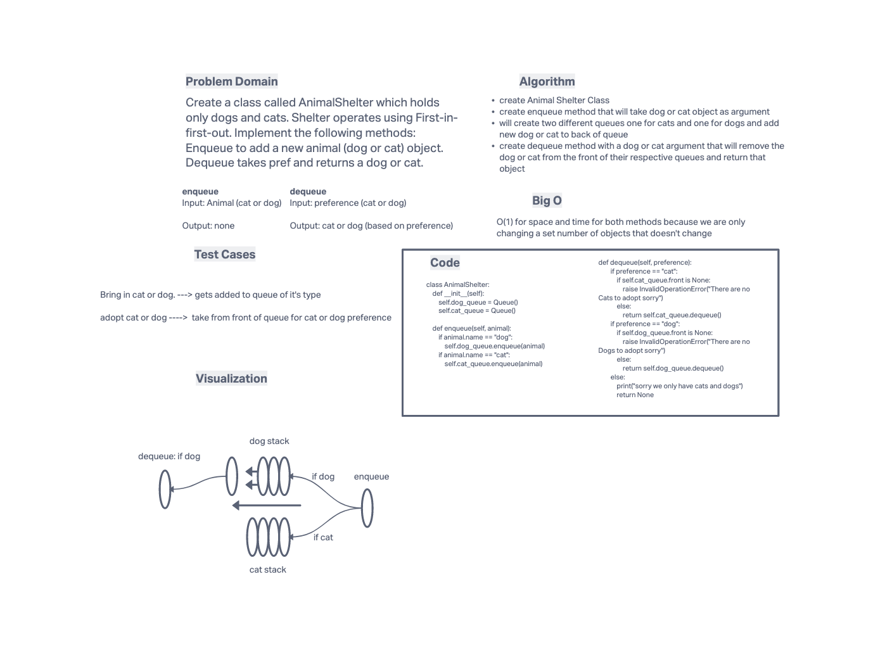

# Challenge Summary
- Create a class called AnimalShelter which holds only dogs and cats.
- The shelter operates using a first-in, first-out approach.
- Implement the following methods:
    - enqueue
        - Arguments: animal
            - `animal`can be either a dog or a cat object.
    - dequeue
        - Arguments: pref
            - `pref` can be either`"dog"` or `"cat"`
        - Return: either a dog or a cat, based on preference.
            - If`pref`is not`"dog"`or`"cat"`then return null.

## Whiteboard Process

## Approach & Efficiency
- create Animal Shelter Class
- create enqueue method that will take dog or cat object as argument
- will create two different queues one for cats and one for dogs and add new dog or cat to back of queue
- create dequeue method with a dog or cat argument that will remove the  dog or cat from the front of their respective queues and return that object

### Big O
- O(1) for space and time for both methods because we are only changing a set number of objects that doesn't change
-
## Solution
code is found at code_challenges/stack_queue_animal_shelter.py

all tests passing from /tests/code_challenges/test_stack_queue_animal_shelter
