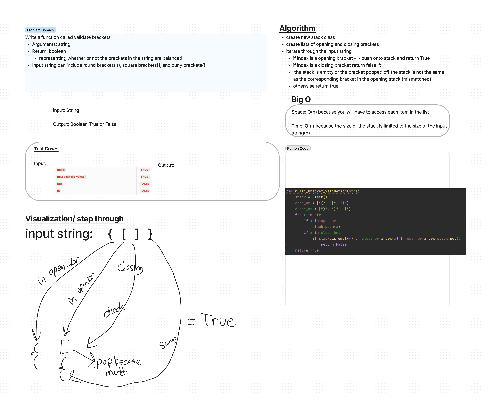

# Challenge Summary
Multi-bracket Validation

Write a function called validate brackets
Arguments: string
Return: boolean
representing whether or not the brackets in the string are balanced

## Whiteboard Process

## Approach & Efficiency
-create new stack class
- create lists of opening and closing brackets
- iterate through the input string
  - if index is a opening bracket - > push onto stack and return True
  - if index is a closing bracket return false if:
  - the stack is empty or the bracket popped off the stack is not the same as the corresponding bracket in the opening stack (mismatched)
  - otherwise return true

Time is O(n) because the size of the Stack can only be as big as the size of the input string (n)
Space is O(n) because you need to iterate through each item in the string once.

## Solution
code is found at /python/code_challenges/stack_queue_brackets.py

## Testing
tests found at tests/code_challenges/test_stack_queue_brackets.py

All tests passing

