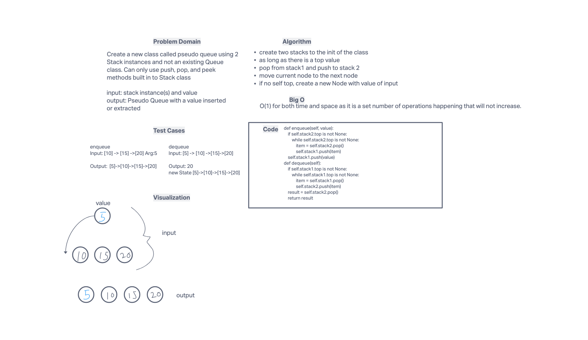

# Challenge Summary
Implement a Queue using two Stacks.

## Whiteboard Process

## Approach & Efficiency
- create two stacks to the init of the class
- as long as there is a top value
- pop from stack1 and push to stack 2
- move current node to the next node
- if no self top, create a new Node with value of input

## Solution
code is found at code_challenges/stack_queue_pseudo.py

## Testing
tests found at tests/code_challenges/test_stack_queue_pseudo.py

All tests passing

