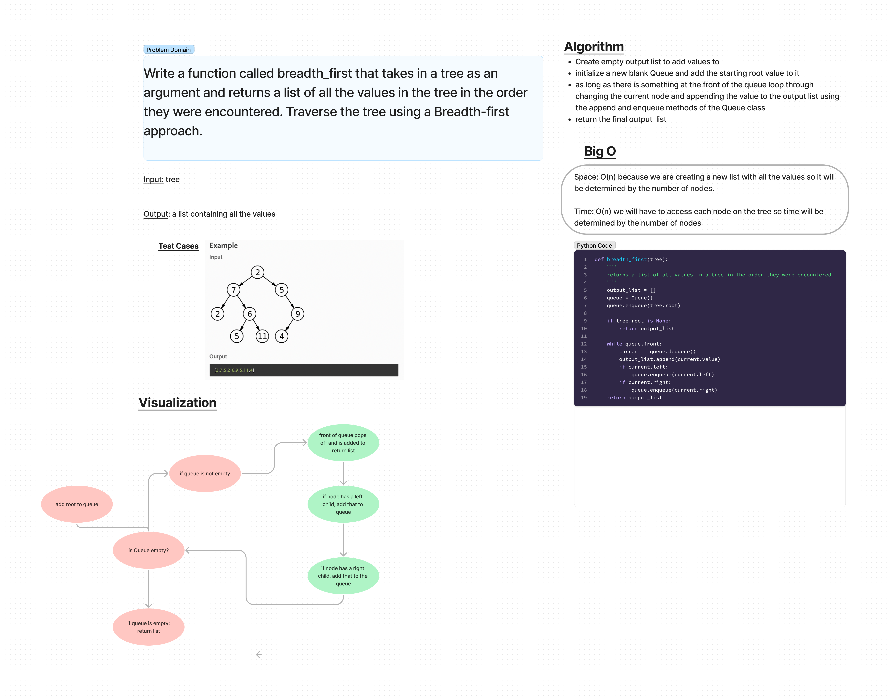

# Challenge Summary
Breadth-first Traversal

## Challenge Type: Code Challenge / Algorithm

## Whiteboard Process

## Approach & Efficiency
I made a loop that adds the root to the queue, then adds left and right child nodes to a queue as it pops off the queue and appends to a list that is built up over time.

## Efficiency
Space: O(n) I "think" however because we are making a new list that will hold all values in the tree this might be something else?

Time: O(n) because it will have to search through every node.

## Solution
Code is found at python/code_challenges/tree_breadth_first.py
all tests passing
