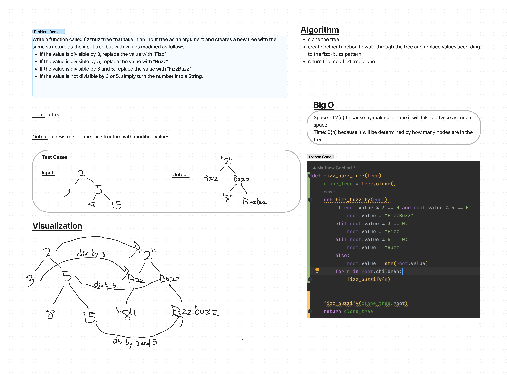

# Code Challenge: Class 18
Write a function called fizz buzz tree
Arguments: k-ary tree
Return: new k-ary tree

Determine whether or not the value of each node is divisible by 3, 5 or both. Create a new tree with the same structure as the original, but the values modified as follows:

If the value is divisible by 3, replace the value with “Fizz”
If the value is divisible by 5, replace the value with “Buzz”
If the value is divisible by 3 and 5, replace the value with “FizzBuzz”
If the value is not divisible by 3 or 5, simply turn the number into a String.

## Whiteboard Process

## Approach & Efficiency
I cloned the tree, then made a helper function to walk through the clone and check for fizz-buzz-able values and changing them when able.

Efficiency is O(n) for time "I think" We have to create a clone of the whole tree which means accessing every node, then access them again to check values and update. For Space I think it is O2(n) because it will take up twice as much space with two trees.

## Solution
found at code_challenges/tree_fizz_buzz.py
runs in .venv virtual environment

