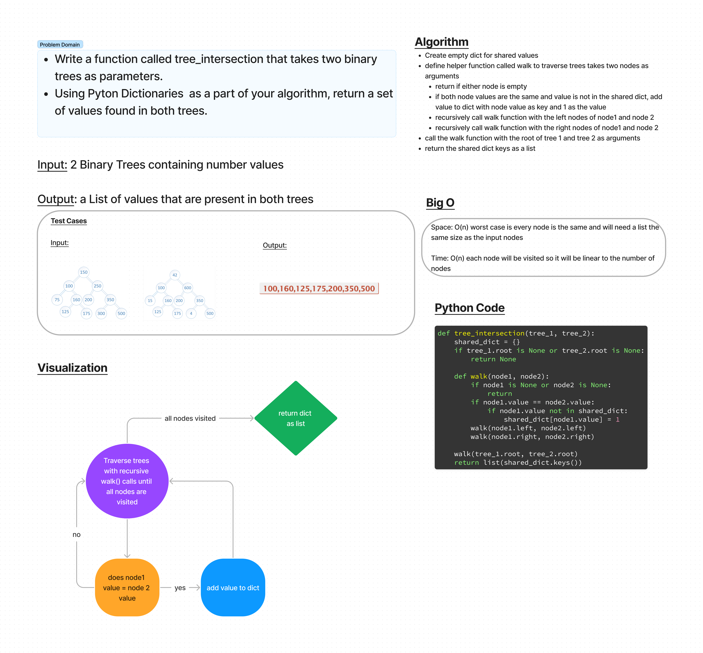

# Code Challenge - Find common values in 2 binary trees
## Challenge Type: Code Challenge / Algorithm
Write a function called tree_intersection that takes two binary trees as parameters.
Using Pyton Dictionaries  as a part of your algorithm, return a set of values found in both trees.
Arguments: two Binary Trees
Return: list of shared values

## Whiteboard Process

## Approach & Efficiency
- traverse both trees with helper walk function
- add values present on both trees to a shared dictionary
- return shared dictionary values as a list

### Big O
-Space: O(n) worst case is every node is the same and will need a list the same size as the input nodes

Time: O(n) each node will be visited, so it will be linear to the number of nodes

## Solution
code is found at code_challenges/tree_intersection.py

all tests passing from /tests/code_challenges/test_tree_intersection.py
