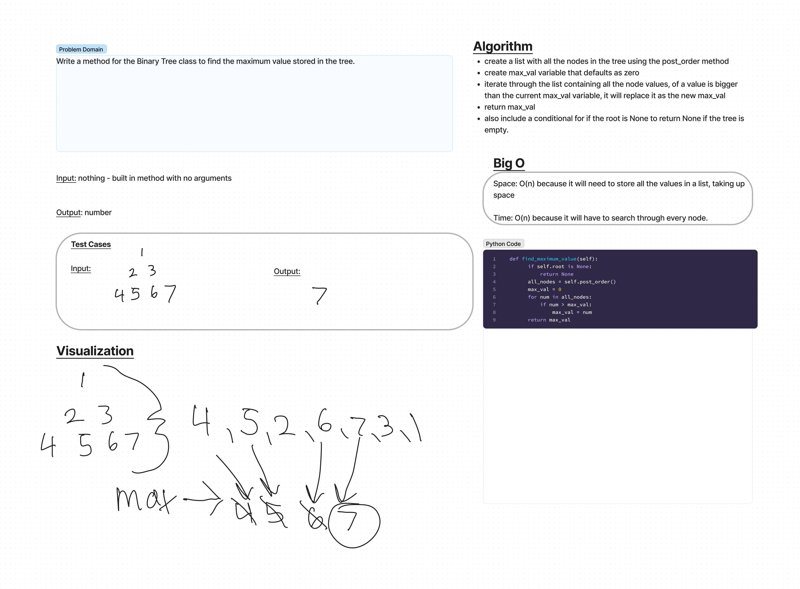

# Challenge Summary
Find the Maximum Value in a Binary Tree

## Challenge Type: Extending an Implementation

## Whiteboard Process

## Approach & Efficiency
I made the tree into a list and then iterated over the list looking for the max number.

## Efficiency
Space: O(n) because it will need to store all the values in a list, taking up space

Time: O(n) because it will have to search through every node.

## Solution
Code is found at python/data_structures/binary_tree.py
all tests passing
