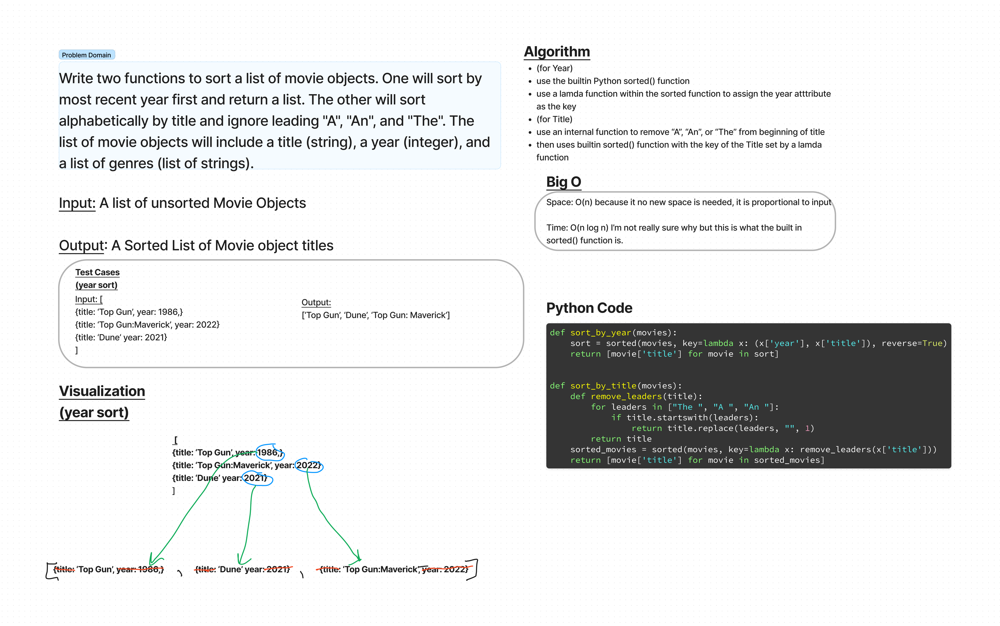

# Comparison Sort
Write two functions to sort a list of movie objects. One will sort by most recent year first and return a list. The other will sort alphabetically by title and ignore leading "A", "An", and "The". The list of movie objects will include a title (string), a year (integer), and a list of genres (list of strings).

## Whiteboard

## Efficiency
- Space: O(n) because everything is sorted in place and no additional space is created.
- Time: O(n log n) the builtin sorted() function uses Tim sort

## Solution and Tests
- The Solution can be found at sorting/comparisons/comparison_sort.py
- tests can be found at sorting/comparisons/test_comparison_sort.py
- tests to confirm function exists, works, and works with empty input
- all tests passing

