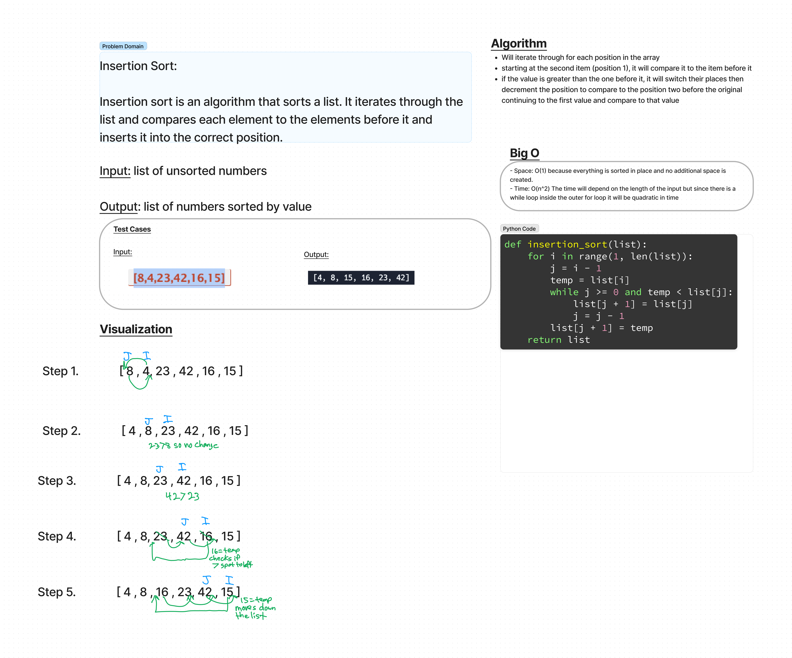

# Insertion Sort
Insertion sort is an algorithm that sorts a list. It iterates through the list and compares each element to the elements before it and inserts it into the correct position.

## Whiteboard

## Efficiency
- Space: O(1) because everything is sorted in place and no additional space is created.
- Time: O(n^2) The time will depend on the length of the input but since there is a while loop inside the outer for loop it will be quadratic in time

## Solution and Tests
The Solution can be found at sorting/insertion/insertion_sort.py
tests can be found at sorting/insertion/test_insertion_sort.py

