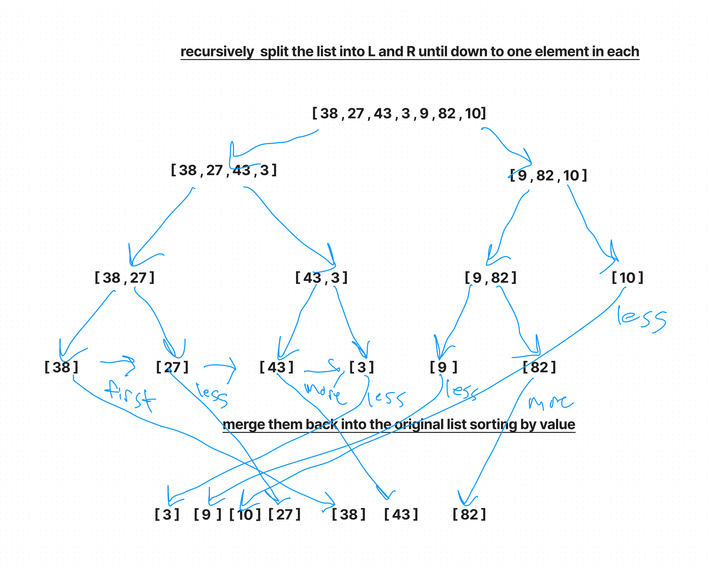

# Blog Notes: Merge Sort
Merge sort is a sorting algorithm that repeatedly splits the input list into smaller left and right lists until each sublist only has one element. Then it merges the sublists back together sorted by value.

## Solution

    def merge_sort(input_list):

      n = len(input_list)

      if n > 1:
          mid = n//2
          left = input_list[:mid]
          right = input_list[mid:]

          merge_sort(left)
          merge_sort(right)

          i = j = k = 0

          while i < len(left) and j < len(right):
              if left[i] <= right[j]:
                  input_list[k] = left[i]
                  i += 1
              else:
                  input_list[k] = right[j]
                  j += 1
              k += 1

          while i < len(left):
              input_list[k] = left[i]
              i += 1
              k += 1

          while j < len(right):
              input_list[k] = right[j]
              j += 1
              k += 1
      return input_list

## Step-By-Step

1. n = len(input_list): The variable n is assigned the length of the input list. This is used later to determine the midpoint of the array.

2. if n > 1:: The merge sort algorithm only needs to be performed if the list has more than one element. If the list has only one element, it is already considered sorted.

3. mid = n//2: The midpoint of the list is determined by dividing the length of the list by 2.

4. left = input_list[:mid]: The left half of the list is obtained by slicing the list from the beginning to the midpoint.

5. right = input_list[mid:]: The right half of the list is obtained by slicing the list from the midpoint to the end.

6. mergeSort(left): The left half of the list is recursively passed into the merge sort function to be sorted.

7. mergeSort(right): The right half of the list is recursively passed into the merge sort function to be sorted.

8. i = j = k = 0: Three variables, i, j, and k are initialized to 0. They are used as indices to keep track of the current position in the left, right, and original arrays respectively.

9. while i < len(left) and j < len(right): This while loop continues until all elements in the left and right arrays have been compared.

10. if left[i] <= right[j]: If the element in the left list at index i is less than or equal to the element in the right list at index j, that element is added to the original list at index k.
else: If the element in the left list at index i is greater than the element in the right list at index j, the element in the right list is added to the original list at index k.

11. k += 1: The index k is incremented to move to the next position in the original list.
i += 1: The index i is incremented to move to the next position in the left list.
j += 1: The index j is incremented to move to the next position in the right list.

12. while i < len(left):: After all elements in the left and right arrays have been compared, this while loop adds any remaining elements in the left list to the original list.
while j < len(right):: After all elements in the left and right arrays have been compared, this while loop adds any remaining elements in the right list to the original list.

## Illustration

## Efficiency
Time complexity: O(n log n)
In the worst case scenario, the array needs to be split in half log n times (i.e. log base 2 of n) and on each level, we need to compare and merge n elements, thus resulting in O(n log n) time complexity.

Space complexity: O(n) because we are creating two new arrays on each recursive call. These arrays take up a total of n extra space, which is the same as the original array.

## Tests
solution is found at merge/merge_sort.py
tests can be found at merge/test_merge_sort.py

## Tools used
- Figma
- ChatGPT (to make sense of the weird pseudocode)
